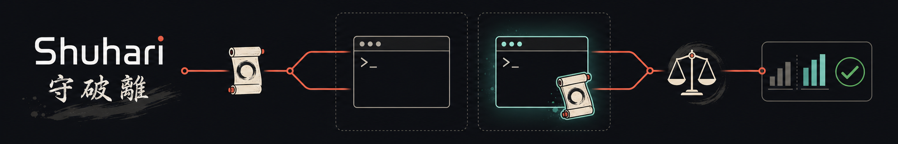

# Shuhari

[](https://github.com/shunk031/shuhari/actions/workflows/ci.yml)
[](https://codecov.io/github/shunk031/shuhari)



[`Shuhari` (守破離)](https://en.wikipedia.org/wiki/Shuhari) evaluates skills and persistent instructions against real coding agents, following the [Agent Skills evaluation workflow](https://agentskills.io/skill-creation/evaluating-skills).

## Supported agents

Agents are listed alphabetically by product name; support status reflects the adapters currently implemented in Shuhari.

| Agent | Support | Notes |
| --- | --- | --- |
| [](https://github.com/google-antigravity/antigravity-cli) | Not yet supported | Adapter not implemented; replaces Gemini CLI for individual/free users. |
| [](https://github.com/anthropics/claude-code) | Not yet supported | Adapter not implemented. |
| [](https://github.com/openai/codex) | ✅ Supported | Install `codex`, add it to your `PATH`, and run `codex login` before using Shuhari. |
| [](https://cursor.com/docs/cli/overview) | Not yet supported | Adapter not implemented. |
| [](https://github.com/anomalyco/opencode) | Not yet supported | Adapter not implemented. |
| Other coding agents | Planned | Additional adapters are planned. |

Adapters are narrow; eval schemas and workspace artifacts stay the same across agents. See the [development architecture contract](docs/architecture.md) and the [evaluation framework comparison](docs/comparison.md).

## Install

### GitHub Releases

Download the archive for your platform from the [releases page](https://github.com/shunk031/shuhari/releases), extract it, and place `shuhari` on your `PATH`.

### Go

Requires Go 1.24 or newer:

```sh
go install github.com/shunk031/shuhari/cmd/shuhari@latest
```

### mise

```sh
mise use -g github:shunk031/shuhari
```

## How to Use

- `shuhari eval` compares results with and without guidance, following the [Agent Skills evaluation workflow](https://agentskills.io/skill-creation/evaluating-skills).
  - `shuhari eval skill <skill-path-or-file>...`
  - `shuhari eval instructions <instructions-file>`
- `shuhari check` measures gate-oriented behavior for [pre-commit](https://github.com/pre-commit/pre-commit) hooks and CI jobs.
  - `shuhari check trigger <skill-path>`

### Evaluate a skill

Place `evals/evals.json` inside the skill directory:

```json
{
  "skill_name": "csv-analyzer",
  "evals": [
    {
      "id": 1,
      "prompt": "Find the top three months by revenue and make a bar chart.",
      "expected_output": "A labeled bar chart with the three highest-revenue months.",
      "files": ["evals/files/sales.csv"],
      "assertions": [
        "The output identifies the correct three months.",
        "The chart has labeled axes."
      ]
    }
  ]
}
```

Then run:

```sh
shuhari eval skill path/to/csv-analyzer
```

Each case runs with and without the skill in fresh sandboxed workspaces, a grader checks the assertions with evidence, and a blind comparator picks the more useful output. Results land in an iteration workspace next to the skill:

```text
csv-analyzer-workspace/
└── iteration-1/
    ├── eval-1/
    │   ├── comparison.json
    │   ├── with_skill/    # outputs/, transcript.jsonl, timing.json, grading.json
    │   └── without_skill/
    ├── benchmark.json     # pass rates, deltas, assertion audit
    └── manifest.json      # input/runner/judge identities
```

Artifact contracts are the JSON Schemas under [`schemas/`](schemas/).

### Evaluate instructions

Pair `AGENTS.md` with `AGENTS.evals.json` (same case format), or point elsewhere with `--evals`:

```sh
shuhari eval instructions path/to/AGENTS.md
```

### Check skill triggers

Put positive cases and near-miss negative controls in `evals/triggers.json`:

```json
{
  "skill_name": "csv-analyzer",
  "cases": [
    {
      "id": "relevant",
      "prompt": "Analyze this sales CSV and chart the result.",
      "should_trigger": true
    },
    {
      "id": "near-miss",
      "prompt": "Explain what comma-separated values are.",
      "should_trigger": false
    }
  ]
}
```

```sh
shuhari check trigger path/to/csv-analyzer --trials 3 --jobs 2 --timeout 600
```

By default, positive and negative cases use per-case majority to tolerate one nondeterministic outcome in three trials. Pass `--strict-all-trials` when every trial must match `should_trigger`.

### Add a repository gate

Shuhari owns the evaluation mechanism; your repository owns file selection and policy values. Write them explicitly in a [pre-commit](https://github.com/pre-commit/pre-commit) hook or CI job:

```yaml
- repo: local
  hooks:
    - id: skill-eval
      name: evaluate changed skills
      entry: shuhari eval skill --trials 3 --jobs 2 --timeout 600
      language: system
      files: ^skills/.+/(SKILL\.md|evals/.+)$
      pass_filenames: true
```

Exit status: `0` pass, `1` evaluation or trigger failure, `2` invalid input or execution error. All three commands support `--validate-only` for a fast schema check without an agent.

### Configure evaluation runs

Runs are sandboxed and offline by default; pass `--network` for cases that need it. Successful runs are cached (`--no-cache` forces a fresh run); failures keep their evidence and are never cached.

Credential handling is documented in the [credential boundary](docs/architecture.md#credential-boundary) and the `required_actions` contract in [action evidence](docs/architecture.md#action-evidence). If the agent's sandbox cannot start but the environment is already isolated (a CI runner or container), disable it explicitly — Shuhari refuses this without the acknowledgement and labels the verdict:

```sh
SHUHARI_SANDBOX=unsandboxed \
SHUHARI_I_UNDERSTAND_NO_CREDENTIAL_BOUNDARY=1 \
shuhari eval skill path/to/skill --network=true
```

## License

[MIT](LICENSE)
